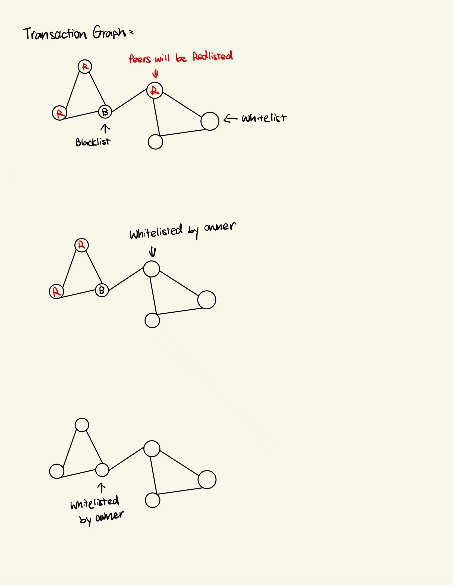

# BlacklistWhitelistAPP

A contract that issues tokens. All wallets on the network are 
initially whitelisted. Whitelisted wallets can transfer tokens to other whitelisted wallets. But
blacklisted wallets do not have the privilege to send or receive tokens. Create
functionality to blacklist wallets. If a wallet is blacklisted, then all peers that have directly
interacted with this wallet also get blacklisted. If a blacklisted wallet is re-whitelisted,
then peers that were blacklisted because of it, also get whitelisted.

## App Design

see demp_app/readme.md

## Contract Design

The transaction graph is stored in the contract using edge lists. So that the peers can be easily modified during the Blacklist or Whitelist setting operations. The graph will be updated after each transaction.

To record the wallet status, 3 status are defined:

0 (white): Whitelisted user

1 (red): Peer of a Blacklisted user

2 (black): Blacklisted user

If a blacklisted wallet is re-whitelisted, then peers that were blacklisted because of it, also get whitelisted. If a affected peer is re-whitelisted, then only this wallet will be whitelisted. The black status will cover the red status, which means when the owner blacklists A and B is the peer, and blacklists B again, the B will not be whitelisted when the owner re-whitelists A.

## Discussion

To store a transaction graph with N wallets and M transactions.

The space complexity is about O(M)

The time complexity for each edge query and modify is O(1)

The time complexity for finding peers is O(peers)

Currently I think this is the best solution to manage the Transaction Graph. But if the graph is really large, storing the whole graph in the contract may not be a good idea.